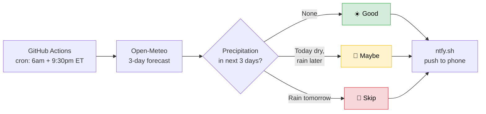

<h1 align="center">Car Wash Time</h1>

  <strong>Should I pay for a car wash today, or is the sky about to waste my money?</strong>

  A zero-cost GitHub Actions workflow that checks the forecast twice a day and sends a push notification telling you whether it's worth washing the car.

  
  
  

---

## Why This Exists

Every morning I drive past the car wash after school dropoff. The car is filthy, the kids have opinions about it, and I can never remember if rain is coming. I'm not going to check three weather apps while merging onto the highway. So I built this. By the time I'm approaching the car wash, I already know whether to pull in or keep driving.

## What You'll Get

Twice a day, a push notification with one of three verdicts:

| Verdict | Notification | Meaning |
|---|---|---|
| **Good** | ☀️ Good day for a wash | No precipitation in the next 3 days. Go for it. |
| **Maybe** | 🤔 Maybe wash it | Today is dry, but rain is coming. Your call. |
| **Skip** | 🚫 Skip the wash | Rain tomorrow. Save your money. |

Repeated "skip" or "maybe" days don't spam you. You only get notified when the verdict is "good" (actionable) or when it changes from the day before.

## Get It Running in 5 Minutes

No server, no API keys, no app to build.

### 1. Fork this repo

Use the **Fork** button at the top right, or click [here](https://github.com/azilnik/Car-wash-time/fork).

### 2. Add two repo variables

On your fork, open **Settings → Secrets and variables → Actions → Variables** (deep link: `https://github.com/YOUR_USERNAME/Car-wash-time/settings/variables/actions`) and add:

| Variable | Example | What it is |
|---|---|---|
| `LOCATION` | `Toronto, Ontario` | City, address, or postal code. Anything a map can find. |
| `NTFY_TOPIC` | `my-carwash-x7k9m2p4` | A unique [ntfy.sh](https://ntfy.sh) topic. Keep it long and random. |

> **Note:** ntfy topics are public by design. Anyone who knows your topic name can subscribe and read your notifications. Pick something nobody would guess.

Skipping this step is fine for a quick test. The workflow ships with demo defaults (NYC + a shared public topic).

### 3. Subscribe on your phone

Install the [ntfy app](https://ntfy.sh) ([iOS](https://apps.apple.com/us/app/ntfy/id1625396347) / [Android](https://play.google.com/store/apps/details?id=io.heckel.ntfy)) and subscribe to your topic.

### 4. Enable Actions on your fork

GitHub disables Actions on forks by default. Open the **Actions** tab on your fork and click the green button to enable them.

### 5. Run it once to confirm

Go to **Actions → Daily Car Wash Check → Run workflow**. You should get a notification within a minute.

That's it. From here on it runs on its own.

## How It Works

The script checks for rain, snow, drizzle, freezing rain, and thunderstorms using [WMO weather codes](https://open-meteo.com/en/docs#weather-code). The whole thing is a single bash script in [`scripts/check.sh`](scripts/check.sh).

## Going Deeper

- **[Privacy](docs/privacy.md)**: what leaks on a public fork, and how to keep your setup private
- **[Customization](docs/customize.md)**: change the schedule, use coordinates instead of an address, file reference

## Tech Stack

Everything here is free and key-free.

| What | Why |
|---|---|
| [Open-Meteo](https://open-meteo.com/) | Weather API, no key |
| [Nominatim](https://nominatim.openstreetmap.org/) | Geocodes your `LOCATION` to coordinates |
| [ntfy.sh](https://ntfy.sh) | Push notifications, no account |
| [GitHub Actions](https://github.com/features/actions) | Scheduled workflows |

## License

[MIT](LICENSE). Do whatever you want with it.

---

<em>Built so I stop wasting money on car washes right before it rains.</em>

